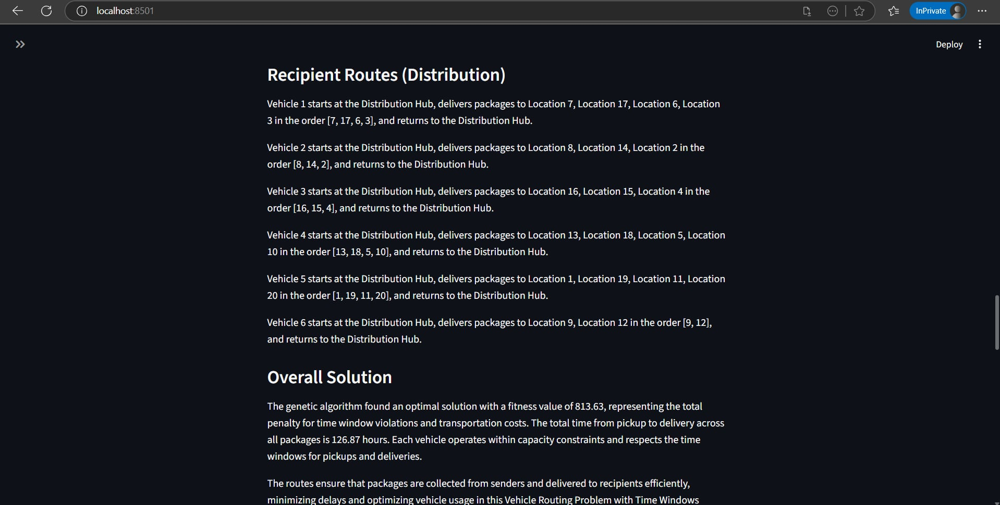
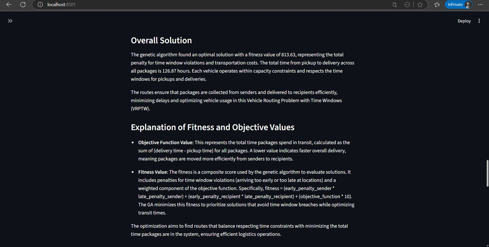
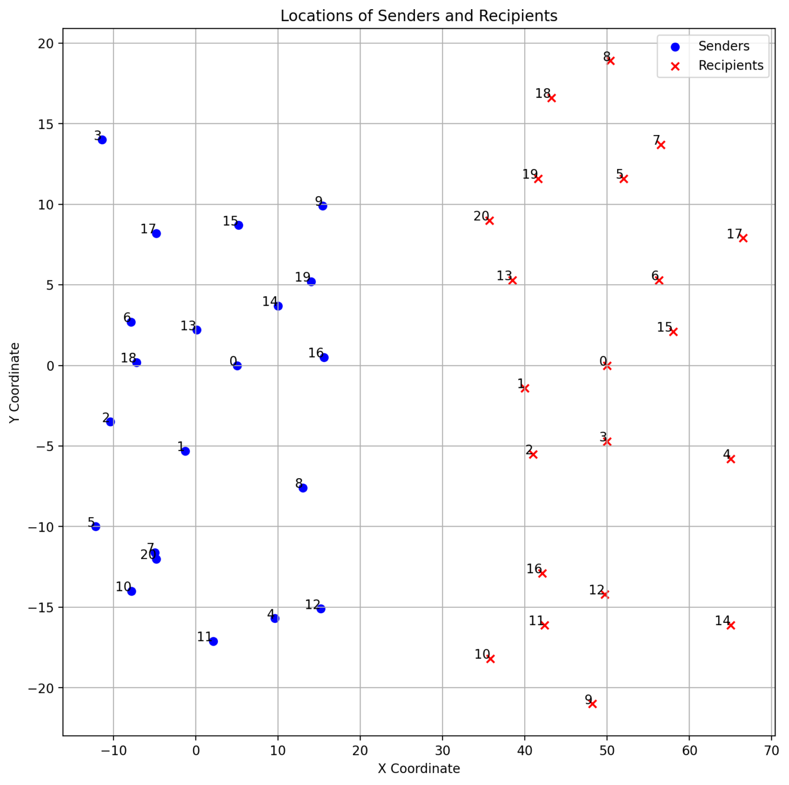
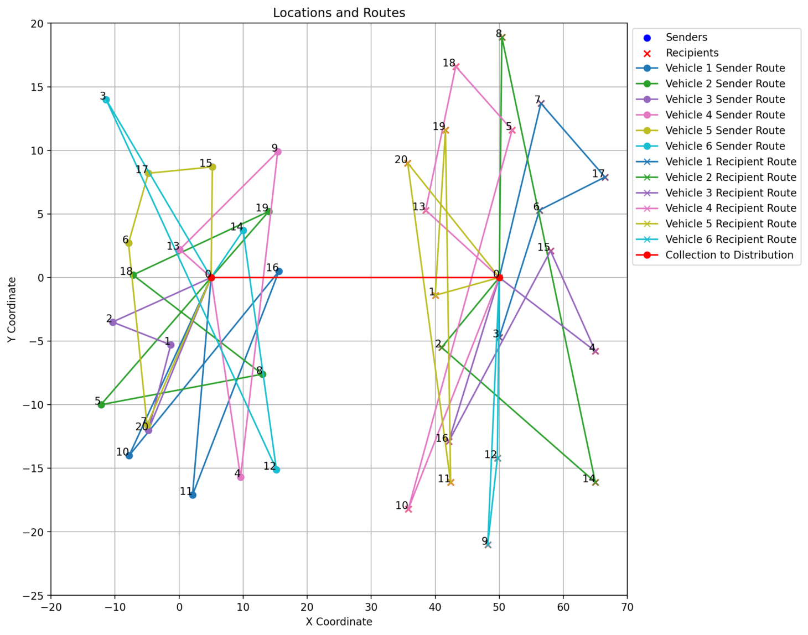

# Problem

The Vehicle Routing Problem with Time Windows (VRPTW) is a classical combinatorial optimization problem in logistics and transportation. The objective is to design optimal routes for a fleet of vehicles that start and end at a central depot to serve a set of customers, subject to the following constraints:

- Each customer must be served exactly once by one vehicle.

- Each vehicle has a limited capacity.
- Each customer has a predefined time window [earliest, latest] during which service must start.

- Vehicles arriving earlier than the time window must wait; arriving later makes the solution infeasible.

- All vehicles depart from and return to the depot.

Optimization objectives: in this project focus on time-based efficiency and constraint satisfaction:

- Minimizing the total pickup-to-delivery time across all packages, defined as the sum of (delivery time − pickup time).

- Minimizing penalties for time window violations at both pickup and delivery locations.
- Ensuring all vehicles operate within capacity constraints and respect all pickup and delivery time windows.

# Solution

This project solves the VRPTW using a Genetic Algorithm (GA) to search for high-quality routing solutions under time window and capacity constraints.

## Description

This project demonstrates the application of genetic algorithms to optimize vehicle routing for package collection and delivery with time window constraints. The system handles 20 senders and 20 recipients, ensuring vehicles operate within capacity limits and respect pickup/delivery time windows.

## Features

- Interactive data editing for senders and recipients.
- Genetic algorithm optimization with configurable generations.

- Visualization of locations and optimized routes.

- Detailed results explanation including fitness and objective values.

- Time arrival tables for packages.

# Results

Due to the stochastic nature of Genetic Algorithms, the solution quality improves progressively with an increasing number of generations, and the algorithm does not converge to a single fixed result. Therefore, results are reported based on representative runs and observed convergence behavior.

- The genetic algorithm consistently produces feasible solutions that satisfy all capacity and pickup/delivery time window constraints.

- Fitness values decrease monotonically over generations, indicating continuous improvement in solution quality.

- Increasing the number of generations further improves or stabilizes the fitness value, demonstrating the effectiveness of the search process.

# Installation

1. Clone the repository:

   ```
   git clone <repository-url>
   cd VRPTW-GA
   ```

2. Install the required packages:
   ```
   pip install -r requirements.txt
   ```

## Usage

1. Run the Streamlit app:

   ```
   streamlit run vrptw-ga.py
   ```

2. Open your browser to the provided local URL (usually http://localhost:8501)

3. Use the interface to:
   - View and edit input data
   - Adjust simulation settings (number of generations)
   - Run the genetic algorithm
   - Explore results and visualizations

# Demo









